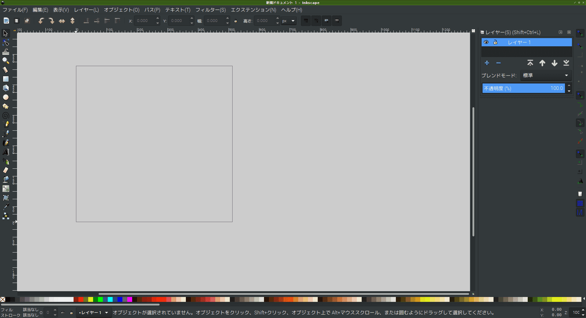

# 画面サイズ

　デフォルトはA4縦サイズである。これをアイコン用に512pxの正方形サイズにしたい。

## 変更する

1. メニュー
1. ファイル
1. ドキュメントのプロパティ`Shift+Ctrl+D`
1. カスタムサイズ
    1. 単位: `px`
    1. 幅: `512`
    1. 高さ: `512`

# デフォルト設定にする

　デフォルト用設定ファイルを書き換える。以下URL参考。

* https://akapeso.info/1059317775/

　以下のような手順。

1. 探す。デフォルト用設定ファイルパスを
2. 解析する。設定ファイルを
3. 編集する。設定ファイルを
4. 確認する。inkscapeを起動して反映されたか

## 1. 探す。デフォルト用設定ファイルパスを

```sh
/usr/share/inkscape/templates/default.ja.svg
```

　編集前にバックアップを保存しておく。

```sh
cd /usr/share/inkscape/templates
sudo cp default.ja.svg default.ja_backup.svg
```

　パスは環境によって異なる。私は以下をヒントにした。

```sh
which inkscape
```
```sh
/usr/bin/inkscape
```

　あとは[Filesystem Hierarchy Standard](https://ja.wikipedia.org/wiki/Filesystem_Hierarchy_Standard)をヒントにした。Linuxのファイル構造は大体決まっているので、inkscapeの名前をキーにして探した。

## 2. 解析する。設定ファイルを

```sh
sudo vim default.ja.svg
```

　読込専用になっていたっぽいので`sudo`で実行した。しかしなぜか`sudo`をつけるとクリップボードと連携できなくなった……。

　以下でコピーした。クリップボードに。ファイル内容を。

```sh
cat default.ja.svg | xsel -ib
```

### デフォルト値

　ファイル内容をテキストエディタで表示すると以下。

```svg
<?xml version="1.0" encoding="UTF-8" standalone="no"?>
<!-- Created with Inkscape (http://www.inkscape.org/) -->
<svg
   xmlns="http://www.w3.org/2000/svg"
   xmlns:sodipodi="http://sodipodi.sourceforge.net/DTD/sodipodi-0.dtd"
   xmlns:inkscape="http://www.inkscape.org/namespaces/inkscape"
   xmlns:xlink="http://www.w3.org/1999/xlink"
   xmlns:rdf="http://www.w3.org/1999/02/22-rdf-syntax-ns#"
   xmlns:cc="http://web.resource.org/cc/"
   xmlns:dc="http://purl.org/dc/elements/1.1/"
   width="210mm"
   height="297mm"
   viewBox="0 0 210 297">
  <defs />
  <sodipodi:namedview
     id="base"
     pagecolor="#ffffff"
     bordercolor="#666666"
     borderopacity="1.0"
     inkscape:pageopacity="0.0"
     inkscape:pageshadow="2"
     inkscape:zoom="0.35"
     inkscape:cx="400"
     inkscape:cy="560" 
     inkscape:document-units="mm"
     inkscape:current-layer="layer1" />
  <metadata>
    <rdf:RDF>
      <cc:Work
         rdf:about="">
        <dc:format>image/svg+xml</dc:format>
        <dc:type
           rdf:resource="http://purl.org/dc/dcmitype/StillImage" />
      </cc:Work>
    </rdf:RDF>
  </metadata>
  <g inkscape:label="レイヤー 1" inkscape:groupmode="layer" id="layer1" />
</svg>
```

### サイズ

　サイズに関係ありそうなのは以下。

```svg
   width="210mm"
   height="297mm"
   viewBox="0 0 210 297">
```
```svg
     inkscape:document-units="mm"
```

　おそらく以下のように編集するといい。

```svg
   width="512px"
   height="512px"
   viewBox="0 0 512 512">
```
```svg
     inkscape:document-units="px"
```

### ページ色

```svg
     pagecolor="#ffffff"
```

　真っ白で目が痛い。灰色にする。

```svg
     pagecolor="#cccccc"
```

### 画面サイズ境界の影？

　デフォルトでは影あり。

```svg
     inkscape:pageshadow="2"
```

　`0`にすると影なしになると思う。

```svg
     inkscape:pageshadow="0"
```

## 3. 編集する。設定ファイルを

　今回は以下のように編集した。

```svg
<?xml version="1.0" encoding="UTF-8" standalone="no"?>
<!-- Created with Inkscape (http://www.inkscape.org/) -->
<svg
   xmlns="http://www.w3.org/2000/svg"
   xmlns:sodipodi="http://sodipodi.sourceforge.net/DTD/sodipodi-0.dtd"
   xmlns:inkscape="http://www.inkscape.org/namespaces/inkscape"
   xmlns:xlink="http://www.w3.org/1999/xlink"
   xmlns:rdf="http://www.w3.org/1999/02/22-rdf-syntax-ns#"
   xmlns:cc="http://web.resource.org/cc/"
   xmlns:dc="http://purl.org/dc/elements/1.1/"
   width="512px"
   height="512px"
   viewBox="0 0 512 512">
  <defs />
  <sodipodi:namedview
     id="base"
     pagecolor="#cccccc"
     bordercolor="#666666"
     borderopacity="1.0"
     inkscape:pageopacity="0.0"
     inkscape:pageshadow="0"
     inkscape:zoom="1.0"
     inkscape:cx="700"
     inkscape:cy="200" 
     inkscape:document-units="px"
     inkscape:current-layer="layer1" />
  <metadata>
    <rdf:RDF>
      <cc:Work
         rdf:about="">
        <dc:format>image/svg+xml</dc:format>
        <dc:type
           rdf:resource="http://purl.org/dc/dcmitype/StillImage" />
      </cc:Work>
    </rdf:RDF>
  </metadata>
  <g inkscape:label="レイヤー 1" inkscape:groupmode="layer" id="layer1" />
</svg>
```

## 4. 確認する。inkscapeを起動して反映されたか

　反映された。OK。



