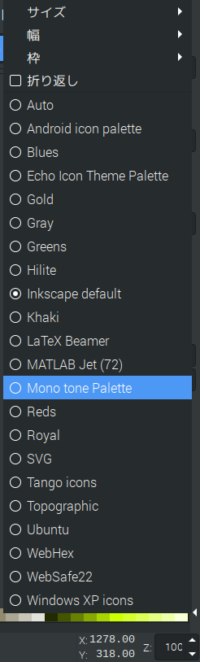
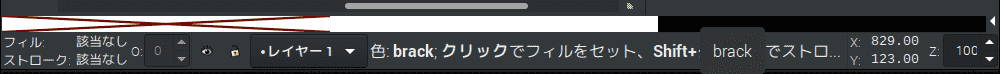

# 独自パレットを作る

　パレットは色見本のこと。

# 手順

1. 見つける。設定ファイルパスを
2. 解析する。設定ファイルを
3. 作る。設定ファイルを
4. 確認する。パレットを

## 1. 見つける。設定ファイルパスを

```sh
/usr/share/inkscape/palettes/*.gpl
```

　たとえば以下。

```sh
/usr/share/inkscape/palettes/inkscape.gpl
```
## 2. 解析する。設定ファイルを

```sh
/usr/share/inkscape/palettes/webhex.gpl
```
```gpl
GIMP Palette
Name: WebHex
#
255 255 255 FFFFFF
255 255 204 FFFFCC
255 255 153 FFFF99
255 255 102 FFFF66
255 255  51 FFFF33
255 255   0 FFFF00
...
```
```sh
/usr/share/inkscape/palettes/echo-palette.gpl
```
```gpl
GIMP Palette
Name: Echo Icon Theme Palette
Columns: 3
#
 25 174 255     Blue1
  0 132 200     Blue2
  0  92 148     Blue3
...
```

　`Columns`は何を意味しているかわからん。ただ、以下のようなフォーマットであることはわかった。

*.gpl
```gpl
GIMP Palette
Name: Echo Icon Theme Palette
#
255 255 255 ポップアップメッセージ
255 255 255 ポップアップメッセージ
255 255 255 ポップアップメッセージ
...
```

## 3. 作る。設定ファイルを

mono.gpl
```gpl
GIMP Palette
Name: Mono tone Palette
#
255 255 255 white
  0   0   0 brack
```

　とりあえず白黒モノトーンのパレットを作ってみた。

　これをコピーする。

```sh
sudo cp mono.gpl /usr/share/inkscape/palettes/mono.gpl
```

## 4. 確認する。パレットを

1. inkscapeを起動する
1. 画面右下の左三角形`◀`をクリックする
1. パレット名リストが出る
1. 作成した`Mono tone Palette`をクリックする

1. 画面下にパレット通りの色が出る。


　なぜか最初に無色透明が出る。それ以降は設定ファイルの上から順に出る。今回なら左から透明、白、黒の3色が出る。

# カラーパレット

## ファイル形式

### 標準化されていない

　カラーパレットの標準化された規格はググっても見つけられなかった。エディタごとに独自形式となっている。[提案](https://www.openraster.org/proposals/palette.html)ならあるが普及していないし微妙。

### 要望

* 「色のグループ化」したい
* メタデータが欲しい。最低でも、index, id, labelくらいは欲しい
* 表色系を指定したい。bit深度も。24bitカラーのRGBと決められているが自由に指定したい
* 記述形式を指定したい。10進数で`255`とするのか、16進数で`FF`とするのか、百分率か、いくつかを併記するのか
* パレットのUIも自由に作りたい。SVGで形をつくり、どこに何の色を配置するか指定できるようにしたい

# 表色系

* 混色系
    * CIE表色系
        * RGB表色系
        * XYZ表色系
        * xyY表色系
        * L*u*v*表色系
        * L*a*b*表色系
    * オスワルト
* 顕色系
    * マンセル
    * PCCS
    * JIS標準
    * NCS
    * DIN
* 色材混合系
    * CMYK
    * DICカラーガイド
    * 塗装用標準見本帳
    * SCOTDIC

　他にも以下がある。

* [色空間](https://ja.wikipedia.org/wiki/Category:色空間)
    * [HSV(HSB)](https://ja.wikipedia.org/wiki/HSV%E8%89%B2%E7%A9%BA%E9%96%93)
    * [HLS(HSL,HSI)](https://ja.wikipedia.org/wiki/HLS%E8%89%B2%E7%A9%BA%E9%96%93)

# 配色

* [配色](https://ja.wikipedia.org/wiki/%E9%85%8D%E8%89%B2)
　
　色の特性を考えて使う色を決める。

